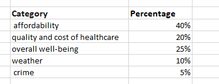
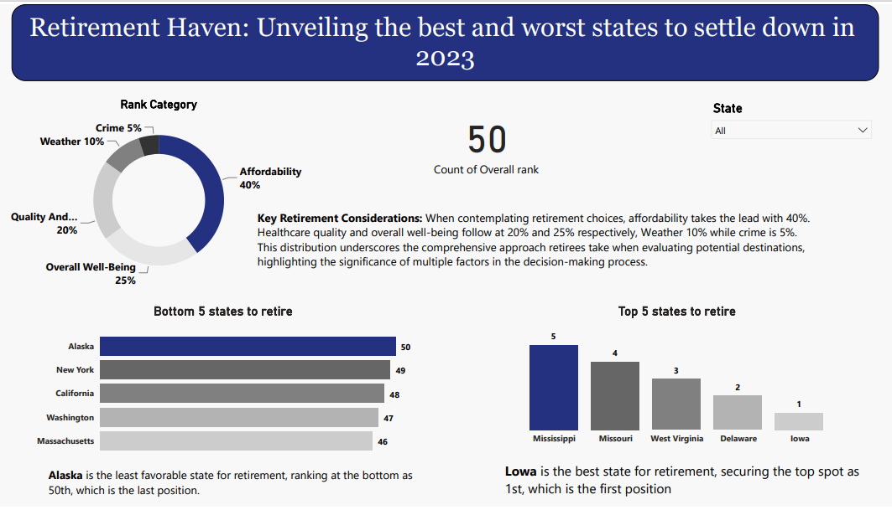

# A Comprehensive Analysis on States to retire in 2023
## Home Tab

-----------

This project is in accordance with the N30days learning program, organized by Mr. Olanrewaju Oyinbooke, a Senior Cloud Advocate at Microsoft. The program took place in June 2022.

This file comprises of 2 tabs which are:
- Retirement Analysis Dashboard
- Analysis by other Categories

----------------
# Problem Statement
This project aims to address the concerns surrounding favorable and unfavorable retirement destinations, assisting individuals in making informed choices for their retirement locations, considering a variety of influencing factors.

-------------
# Objective
- To determine the **Best** and **worst** States to retire in 2023.
- To also analyze how the categories are assigned to each state.
- To examine how states compare in various retirement categories.

---------------
# Skills Demonstrated
I used Power BI to create the dashboard, and I also cleaned and organized the data using Power Query Editor before creating the visualizations.

------------------------
# Data Sourcing / Gathering
I gathered the data by extracting it from the internet and obtained another portion of the dataset in CSV format from the website.
Howwver, the main data which was downloaded from the website contains 50 rows and 7 columnns.

-----------------
# Data Transformation / Cleaning
The data transformation and cleaning process involved utilizing the Power Query Editor for efficient cleansing. I also extracted category-assigned data points from the web, which were subsequently placed into an Excel file before importing them into Power BI. 

Screenshot is provided below.

Furthermore, the primary dataset containing state-related factors underwent thorough cleaning in the Power Query Editor.

---------------
# Analysis and Visualizations
As previously mentioned in the introduction of this documentation, the data has been visualized across two tabs. The initial tab is displayed below.

#### From the dashboard above👆🏽, it is observed that
- Alaska is ranking as the last position indicating that it is the worst country to settle in.
- On the otherhand, Lowa is ranking as the first position which indicates that it is the best state to settle in.
- Nevertheless, the visualization of the analysis regarding categories assigned to each state is presented in a pie chart.

  The second tab is displayed below👇🏽

