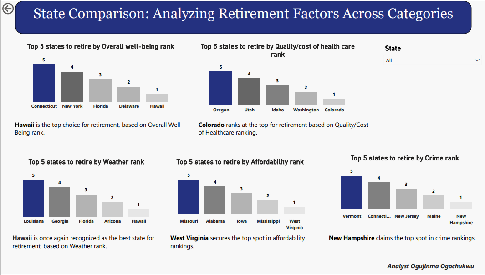

# A Comprehensive Analysis on States to retire in 2023
## Home Tab

-----------

This project is in accordance with the N30days learning program, organized by Mr. Olanrewaju Oyinbooke, a Senior Cloud Advocate at Microsoft. The program took place in June 2022.

This file comprises of 2 tabs which are:
- Retirement Analysis Dashboard
- Analysis by other Categories

----------------
# Problem Statement
This project aims to address the concerns surrounding favorable and unfavorable retirement destinations, assisting individuals in making informed choices for their retirement locations, considering a variety of influencing factors.

-------------
# Objective
- To determine the **Best** and **worst** States to retire in 2023.
- To also analyze how the categories are assigned to each state.
- To examine how states compare in various retirement categories.

---------------
# Skills Demonstrated
I used Power BI to create the dashboard, and I also cleaned and organized the data using Power Query Editor before creating the visualizations.

------------------------
# Data Sourcing / Gathering
I gathered the data by extracting it from the internet and obtained another portion of the dataset in CSV format from the website.
However, the main data which was downloaded from the website contains 50 rows and 7 columnns.

-----------------
# Data Transformation / Cleaning
The data transformation and cleaning process involved utilizing the Power Query Editor for efficient cleansing. I also extracted category-assigned data points from the web, which I subsequently placed into an Excel file before importing them into Power BI. 

Screenshot is provided below.

Furthermore, the primary dataset containing state-related factors underwent thorough cleaning in the Power Query Editor.

---------------
# Analysis and Visualizations
As previously mentioned in the introduction of this documentation, the data has been visualized across two tabs. The initial tab is displayed below.

#### From the dashboard above👆🏽, it is observed that
- Alaska is ranking as the last position indicating that it is the worst country to settle in.
- On the otherhand, Lowa is ranking as the first position which indicates that it is the best state to settle in.
- Nevertheless, the visualization of the analysis regarding categories assigned to each state is presented in the pie chart.

 ### The second tab is displayed below👇🏽

  

The second slide of the dashboard, depicted above👆🏽, illustrates the comparison of retirement factors across all states. This helps to visualize the individual rankings of each state in these factors.

- As seen, Hawaii ranks as the best place to retire based on overall-wellbeing factor.
- Colorado is the best place to retire based on Quality/Cost of healthcare factor.
- Hawaii is once again seen as the best place to retire based on Weather factor.
- West Virginia is the best place to retire based on Affordability factor.
- And lastly, New Hampshire is the best place to retire based on Crime factor.

------------------------

# Conclusion and Recommendation

**Conclusion:**

The analysis of various factors influencing retirement destinations reveals valuable insights for individuals seeking the ideal place to retire in 2023. States like Hawaii, Colorado, and West Virginia stand out in different categories, emphasizing the importance of considering specific factors when making this significant life decision.

**Recommendation:**

**Personal Priorities:** Consider your personal priorities when choosing a retirement destination. If overall well-being is a top concern, Hawaii offers a compelling option. For quality and cost of healthcare, Colorado may be the best choice.

**Budget and Affordability:** If budgetary constraints are a significant factor, West Virginia's affordability makes it an attractive option. Careful financial planning can maximize the quality of life in this state.

**Weather Preferences:** For those who prioritize pleasant weather, Hawaii's consistent climate provides a comfortable and enjoyable retirement environment.

**Safety and Crime:** New Hampshire's low crime rate makes it a secure choice for retirement, especially for those who value safety and peace of mind.

**Diverse Retirement Options:** Keep in mind that retirement preferences vary widely. Some may prioritize affordability, while others prioritize healthcare or climate. Ultimately, it's essential to align your retirement destination with your unique lifestyle, preferences, and financial situation.

**Additional Research:** Conduct further research and consider other factors not covered in this analysis, such as proximity to family, recreational opportunities, and cultural amenities, to make a well-informed decision.

**In conclusion**, the dataset offers valuable insights into the best states for retirement based on specific factors. However, the ideal retirement destination is highly subjective and depends on individual preferences, needs, and circumstances. It's recommended to weigh these factors carefully and conduct thorough research before making a decision to ensure a fulfilling and enjoyable retirement.

